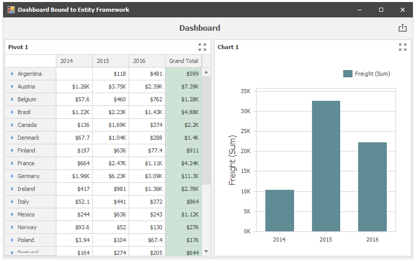

<!-- default file list -->
*Files to look at*:

* [Form1.cs](./CS/Dashboard_EntityFramework/Form1.cs) (VB: [Form1.vb](./VB/Dashboard_EntityFramework/Form1.vb))
* [OrdersContext.cs](./CS/Dashboard_EntityFramework/OrdersContext.cs) (VB: [OrdersContext.vb](./VB/Dashboard_EntityFramework/OrdersContext.vb))
<!-- default file list end -->
# How to Bind a Dashboard to an Entity Framework Data Source at Runtime

The following example demonstrates how to bind a dashboard to the SQLite database using Entity Framework 6.

In this example, the <a href="http://docs.devexpress.com/Dashboard/DevExpress.DashboardCommon.DashboardEFDataSource">DashboardEFDataSource</a> class is used to connect the dashboard to the Entity Framework data source.

## Documentation

* [Creating Dashboards in the WinForms Designer - Entity Framework Data Source](https://docs.devexpress.com/Dashboard/113909)

## More Examples

* [How to: Bind the Web Dashboard to Entity Framework](https://docs.devexpress.com/Dashboard/117074)
* [ASP.NET MVC Dashboard - How to bind a dashboard to an Entity Framework Data Source](https://github.com/DevExpress-Examples/aspnet-mvc-dashboard-how-to-bind-a-dashboard-to-an-entity-framework-data-source-t551381)
